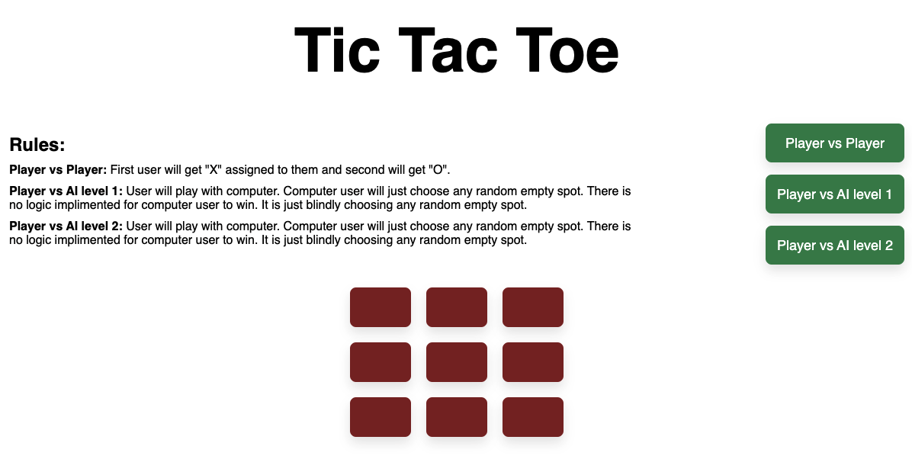

# Tic Tac toe
User can chose to play with another player, Computer level1 and Computer level 2

## Description:
There will be three options for user to select:

* **Player vs Player**

  First user will get "X" assigned to them and second will get "O".

* **Player vs Computer Lvl1**

  User will play with computer. Computer user will just choose any random empty spot.
  There is no logic implimented for computer user to win. It is just blindly choosing any
  random empty spot.

* **Player vs Computer Lvl2**

  User will be playing with Computer who is programmed to win. With every move, computer will
  try to choose best spot.

**How it is started:**

